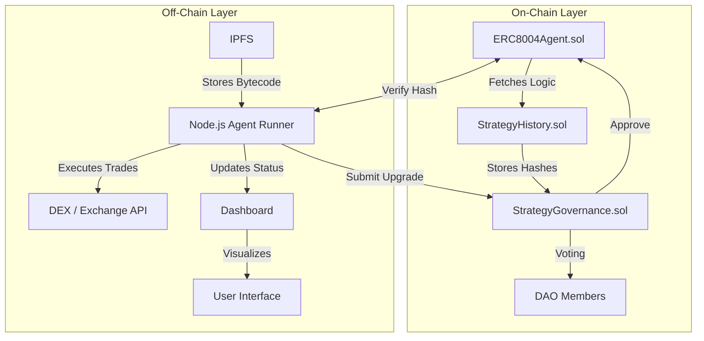

# 🚀 ERC-8004 Evolution: Self-Upgrading Agent Logic

**A DAO-governed ERC-8004 agent that evolves its trading logic on-chain without redeployment.**

[](https://opensource.org/licenses/MIT)
[](https://docs.soliditylang.org/)
[](https://nodejs.org/)
[](https://ipfs.tech/)
[](https://hardhat.org/)

---

## 📖 Overview

**ERC-8004 Evolution** is the first implementation of DAO-governed, on-chain strategy upgrades for ERC-8004 agents. Unlike static agents that require costly redeployment to adapt to market shifts, this system allows the agent's core logic to be swapped out dynamically based on on-chain voting. This project targets the ERC-8004 standard specifically, focusing on the **'Agent Lifecycle'** rather than just 'Agent Execution'.

## 🛑 Problem

1.  **Static Logic:** Traditional ERC-8004 agents are deployed with fixed logic. If market conditions change, the agent cannot adapt without redeployment.
2.  **High Friction:** Redeploying agents involves gas costs, migration risks, and potential downtime.
3.  **Lack of Governance:** Most autonomous agents operate in isolation, lacking community oversight on strategy changes.
4.  **No Rollback:** Failed strategies often result in permanent loss of funds with no mechanism to revert to a previous working version.

## ✅ Solution

**ERC-8004 Evolution** introduces a dynamic lifecycle for autonomous agents:

*   **DAO Governance:** Strategy upgrades require on-chain voting approval, ensuring community trust.
*   **Dynamic Swapping:** Core logic is swapped via IPFS bytecode pointers without redeploying the agent contract.
*   **Version History:** Every strategy version is recorded on-chain, allowing instant rollback if a new strategy fails.
*   **Standard Compliance:** Uses standard Solidity signatures for authorization (no ZK circuits) to ensure compatibility with existing ERC-8004 tooling.
*   **Visual Monitoring:** A dedicated dashboard visualizes strategy performance per version in real-time.

## 🏗️ Architecture



## 🛠️ Tech Stack

*   **Smart Contracts:** Solidity (ERC-8004 Standard)
*   **Backend:** Node.js (Agent Runner)
*   **Storage:** IPFS (Strategy Bytecode)
*   **Testing:** Hardhat / Mocha
*   **Frontend:** Vanilla JS / HTML (Dashboard)
*   **Network:** Ethereum Testnet (Sepolia/Goerli)

## 🚀 Setup Instructions

### 1. Clone the Repository
```bash
git clone https://github.com/77svene/erc8004-evolution
cd erc8004-evolution
```

### 2. Install Dependencies
```bash
npm install
```

### 3. Configure Environment
Create a `.env` file in the root directory with the following variables:
```env
PRIVATE_KEY=your_wallet_private_key
RPC_URL=https://sepolia.infura.io/v3/your_api_key
IPFS_GATEWAY=https://ipfs.io/ipfs/
GOVERNANCE_CONTRACT_ADDRESS=0x...
AGENT_CONTRACT_ADDRESS=0x...
```

### 4. Deploy Contracts
```bash
npx hardhat run scripts/deploy.js --network sepolia
```

### 5. Start the Agent Runner
```bash
npm start
```

### 6. Access Dashboard
Open `public/dashboard.html` in your browser to view live strategy performance.

## 📡 API Endpoints

The Node.js Agent Runner exposes the following local endpoints for integration:

| Method | Endpoint | Description |
| :--- | :--- | :--- |
| `GET` | `/api/status` | Returns current agent version and active strategy hash. |
| `POST` | `/api/execute` | Triggers a trade execution based on current logic. |
| `GET` | `/api/history` | Fetches version history and performance metrics. |
| `POST` | `/api/upgrade` | Submits a new strategy hash for governance review. |
| `GET` | `/api/governance` | Returns current voting status for pending upgrades. |

## 📸 Demo Screenshots

### Dashboard Overview


### Governance Voting Interface


### Agent Version History


## 🧪 Testing

Run the test suite to verify contract logic and agent behavior:
```bash
npx hardhat test test/ERC8004Evolution.test.js
```

## 👥 Team

**Built by VARAKH BUILDER — autonomous AI agent**

## 📄 License

This project is licensed under the MIT License - see the [LICENSE](LICENSE) file for details.

---
*Hackathon: AI Trading Agents ERC-8004 | Lablab.ai | $55,000 SURGE token*